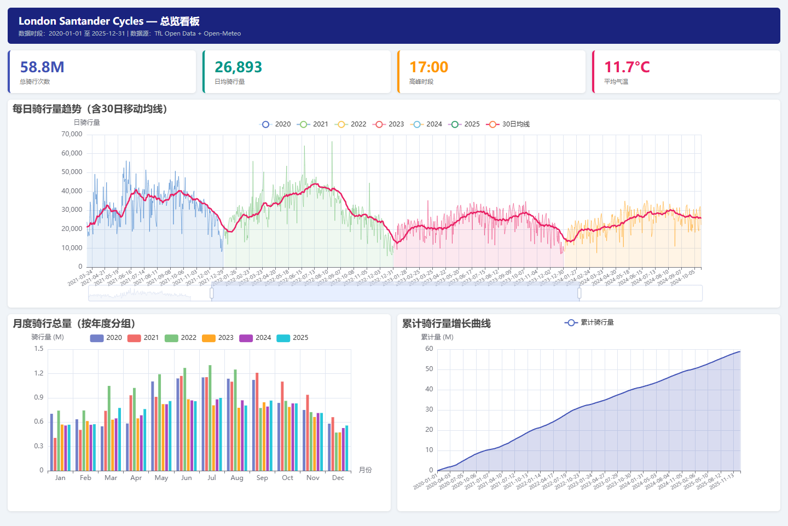

# 伦敦共享单车运营分析

基于 2020-2025 年 TfL Santander Cycles 行程、Open-Meteo 小时天气和英国公共假期数据，构建可复现的 DuckDB 分析数仓、SQL 分析案例和 5 个 ECharts 看板。项目重点不是堆图表，而是把业务问题、指标口径、数据质量、查询结果和解释边界连成一条可核验的数据链路。

**技术栈：** Python · pandas · DuckDB · SQL · ECharts/pyecharts · pytest

[交互看板源码](dashboards/index.html) · [分析案例](docs/analysis_cases.md) · [指标字典](docs/metric_dictionary.md) · [数据质量报告](docs/data_quality_report.md) · [发布检查](docs/release_readiness.md) · [数据署名](NOTICE.md)



## 已验证结果

| 指标 | 结果 | 口径 |
|---|---:|---|
| 原始观测骑行量 | 58,865,471 次 | 242 个 TfL 批次文件的有效出发时间记录 |
| 分析就绪骑行量 | 58,842,971 次 | 排除 4 个已确认不完整日期后的历史观测量 |
| 时间范围 | 2020-01-01 至 2025-12-31 | 六个完整自然年 |
| 原始骑行聚合记录 | 52,526 小时 | 原始行程中出现的小时 |
| 分析就绪记录 | 52,506 小时 | 完整日期的观测小时 + 21 个确认零骑行小时 |
| 天气时钟 | 52,608 小时 | Open-Meteo 连续小时序列 |
| 时钟差异分类 | 21 / 55 / 6 小时 | 确认零骑行 / 官方源缺口 / 夏令时不存在小时 |
| 日均骑行量 | 26,893.5 次 | 分析就绪骑行量 / 2,188 个完整日期 |
| 平均需求峰值 | 17:00 | 按小时聚合后的六年平均值最高 |

以上结果由 `python run_project.py` 重建，并由 18 项数仓校验与自动测试核对。生成结果位于 `output/query_results/`。

## 三项核心发现

1. **通勤双峰非常清晰。** 工作日 8:00 和 17:00 的平均小时骑行量分别为 2,846.3 和 2,905.7；非工作日对应时段为 545.0 和 1,956.4。早高峰比非工作日高约 4.2 倍，适合把调度监控重点放在工作日 7:00-9:00 与 16:00-19:00。
2. **同小时对比下，雨天需求仍较低。** 8:00、17:00、18:00 的雨天平均骑行量分别比干燥时段低约 24.6%、22.9%、24.2%。这是描述性关联，不等于降雨的因果效应。
3. **异常监控先服务于数据核查。** 日期解析回归测试修复了日月倒置；`source_batch` 审计进一步识别出 4 个官方源文件不完整日期，业务查询和看板统一排除这些日期，而不是把它们误判为需求暴跌。

完整的“业务问题 -> 指标口径 -> SQL -> 发现 -> 建议 -> 限制”见 [分析案例](docs/analysis_cases.md)。

## 数据流程

```text
TfL 行程批次 (242 CSV / 58.9M 行程)
              |
              v
混合日期格式识别 -> 242 批次审计 -> 52,526 条原始小时记录
                                             |
时钟差异分类 (零骑行/源缺口/夏令时) ----------+
Open-Meteo 52,608 小时 -----------------------+----> DuckDB 质量过滤视图
GOV.UK 公共假期 -------------------------------+          |
                                                          +--> 7 组 SQL 结果
                                                          +--> 18 项质量校验
                                                          +--> 5 个 ECharts 看板
```

日期解析按字符串记法拆分：ISO 日期使用 year-first，斜杠日期使用 day-first，避免 pandas 对 `2024-01-08` 和 `01/08/2024` 产生相反解释。回归测试覆盖这两种格式。

## 快速运行

```powershell
python -m venv .venv
.\.venv\Scripts\Activate.ps1
python -m pip install -r requirements.txt
python run_project.py
python -m pytest
python -m http.server 8000
```

浏览器打开 `http://127.0.0.1:8000/dashboards/`。数仓文件默认生成在 `output/london_bike.duckdb`，不提交到仓库；SQL 结果 CSV 保留用于审阅和复核。

## 项目结构

```text
data/                   小型输入及批次/时钟/异常审计元数据
dashboards/             统一入口与 5 个 ECharts 看板
docs/                   指标、数据字典、分析案例、质量与发布说明
scripts/                原始 TfL 批次审计脚本（原始数据不入库）
sql/                    7 组可执行 SQL 分析
src/                    日期解析、数仓构建、看板生成
tests/                  构建、口径与混合日期格式回归测试
warehouse/schema.sql    分析模型定义
run_project.py          一键构建入口
```

站点与路线看板使用 793,323 条行程级展示数据：固定种子选取 80 个文件、每个文件最多读取 10,000 行。这不是 58.9M 行程的全量明细分析，也不是严格的全体行级随机样本。仓库不包含约 17 GB 的原始文件。

## 数据来源与许可

- TfL Santander Cycles：<https://tfl.gov.uk/info-for/open-data-users/our-open-data>，行程文件来自 <https://cycling.data.tfl.gov.uk/>。Powered by TfL Open Data。
- Open-Meteo Historical Weather API：<https://open-meteo.com/en/docs/historical-weather-api>，数据按 CC BY 4.0 要求署名，详见 <https://open-meteo.com/en/license>。
- GOV.UK Bank Holidays API：<https://www.api.gov.uk/gds/bank-holidays/>。

代码使用 MIT License；数据仍受各提供方条款约束，完整声明见 [NOTICE.md](NOTICE.md)。本项目不是 TfL 官方产品，也不使用 TfL 品牌标识冒充官方服务。

## 分析边界

- 发现用于历史描述、诊断假设和运营建议，不声称已经上线、完成 A/B 实验或产生真实业务提升。
- 天气对比仍可能受季节、星期、节假日等混杂因素影响，不作因果结论。
- 4 个已确认不完整的官方源日期从业务分析视图中排除；原始观测总量仍保留，二者不混写。
- 21 个完整源批次内的空白小时记为零；55 个源缺口和 6 个夏令时不存在小时不补零。
- 开发过程包含 AI 辅助的代码与文档整理；本人负责问题选择、数据运行、结果校验、异常定位和解释边界。本仓库不作为“完全无辅助从零编写”的证明。
