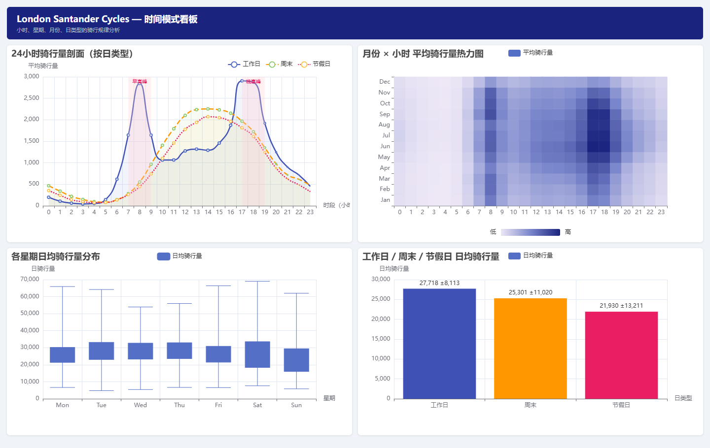

# 三个业务分析案例

## 1. 通勤双峰与时段调度

**业务问题**：工作日与非工作日的需求曲线差异是否足以支持分时调度？

**指标口径**：按 `day_type × hour_of_day` 计算平均与中位小时骑行量。周末或英格兰和威尔士公共假期归为 `non_workday`。

**SQL**：[`sql/04_day_type_hourly_profile.sql`](../sql/04_day_type_hourly_profile.sql)

**发现**：工作日 8:00 平均 2,846.3 次，非工作日为 545.0 次；工作日高约 4.2 倍。工作日 17:00 平均 2,905.7 次，为全日平均峰值；非工作日 17:00 也有 1,956.4 次，但曲线更平缓。

**建议**：工作日把调度和空桩监控重点前移到 7:00-9:00、16:00-19:00；非工作日更适合覆盖午后到傍晚的连续需求，而不是照搬通勤班次。

**限制**：当前小时表是全系统聚合，不能直接定位具体失衡站点；站点级策略需要 `fact_station_hourly` 后续补强。

## 2. 同小时雨天需求对比

**业务问题**：简单的“雨天 vs 晴天”均值会混入时段差异；控制小时后，雨天需求差异是否仍然存在？

**指标口径**：按 `hour_of_day × rain_label` 分组，`precipitation_mm > 0` 定义为雨天，比较平均与中位骑行量。

**SQL**：[`sql/05_rainy_vs_dry_by_hour.sql`](../sql/05_rainy_vs_dry_by_hour.sql)

**发现**：8:00 雨天平均 1,666.5 次，干燥时段 2,210.1 次，低约 24.6%；17:00 和 18:00 分别低约 22.9% 与 24.2%。

**建议**：降雨预报出现时，可降低短时运力需求预期并增加重点站点安全检查；仍应保留最低服务能力，避免只按平均值过度收缩。

**限制**：同小时比较仍未控制季节、星期、节假日、温度和特殊事件，因此只能表述为关联。下一步可使用分层回归或匹配方法检验稳健性。

## 3. 数据异常监控与日期解析修复

**业务问题**：异常峰值究竟是业务事件，还是数据处理问题？

**指标口径**：按日聚合后计算 30 日滚动均值、标准差和 Z 分数；绝对 Z 分数不低于 2 只标记为 `needs_review`。

**SQL**：[`sql/03_daily_rolling_monitor.sql`](../sql/03_daily_rolling_monitor.sql)

**发现**：初版缓存中，2024 年多个“每月 8 日”反复出现不自然高峰。回查原始文件发现 TfL 部分批次在 ISO `YYYY-MM-DD` 与 `DD/MM/YYYY` 间切换；直接使用 pandas `format='mixed'` 会导致日月倒置。修复后再审计 242 个批次，确认 58,865,471 条有效出发时间、0 条解析失败，并把 82 个空白小时拆分为 21 个确认零骑行小时、55 个官方源缺口和 6 个夏令时不存在小时。4 个不完整日期从业务分析视图排除。

**建议**：日期格式识别进入固定回归测试；异常日期先检查源批次、字段格式和覆盖率，再讨论运营事件。

**限制**：`2022-09-10~12` 与 `2025-08-05` 的真实完整骑行量无法从现有官方批次恢复；项目保留原始观测值，但不将这些日期用于业务均值、趋势基线和看板。
